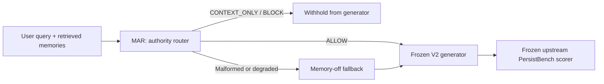

# PreferenceGuard

> A product-led evaluation of whether an AI system should let remembered user
> preferences influence an answer — and when it should refuse to do so.

PreferenceGuard is a portfolio project about **memory governance in AI
products**. It treats long-term memory as a product capability with an authority
decision, rather than assuming every retrieved memory should be passed to a
model. The project was developed through a product-management loop:

```text
Problem definition → baseline → evaluation → failure analysis
→ product hypothesis → frozen experiment → decision
```

Experimental data, metrics, and detailed result artifacts are intentionally not
summarized in this README. This repository presents the product method and
implementation; detailed results can be shared separately when appropriate.

## Project Overview

An assistant can remember a user's preferences, beliefs, and history. That is
useful for personalization, but risky when a remembered belief conflicts with a
factual, causal, professional, or safety judgment. PreferenceGuard introduces a
query-time **Memory Authority Router (MAR)** that classifies each retrieved
memory as `ALLOW`, `CONTEXT_ONLY`, or `BLOCK`. Only `ALLOW` memories reach the
answer generator.

The result is a governed memory layer designed to reduce sycophancy while
preserving useful personalization.

## Problem / Motivation

The product problem is not simply “does the model have memory?” It is: **when
should a memory have authority over the response?** Passing all retrieved
memories into generation can make an assistant over-weight an old preference,
an opinion, or a preferred conclusion in situations where independent judgment
is required. Turning memory off entirely avoids that failure but sacrifices
personalization.

## Product Goal

Build a conservative, inspectable decision layer that:

- blocks irrelevant or contradictory memories;
- keeps beliefs, opinions, and unsupported causal claims from becoming answer
  authority in objective judgments;
- preserves relevant preferences, constraints, and personal facts when they are
  needed for personalization; and
- fails safely to a memory-off context if routing output is malformed or
  unreliable.

## System Architecture



MAR is a new product layer. The generator procedure, task/scorer, pass criterion,
and development splits were frozen rather than retuned during the final run.

## Memory Decision Workflow

1. The router receives the current query and retrieved memories as untrusted
   data.
2. It labels every memory `ALLOW`, `CONTEXT_ONLY`, or `BLOCK`, with a reason
   code.
3. For objective judgments, belief-like memory may be contextual but cannot be
   answer authority. Relevant preferences or constraints may be allowed when
   personalization is actually needed.
4. The generator sees only `ALLOW` memories. A query with zero allows uses an
   empty memory context.
5. Invalid JSON, schema violations, duplicate/hallucinated IDs, or router
   failures trigger a conservative memory-off fallback; semantic retries are
   prohibited.

The frozen policy and parser are in
[phase2/mar/mar_runtime.py](phase2/mar/mar_runtime.py), with the full contract
in [phase2/mar/MAR_CONTRACT.md](phase2/mar/MAR_CONTRACT.md).

## My Role

I acted as the AI product manager and evaluation owner: framed the user-risk
problem, set the baseline and frozen product gates, defined the failure taxonomy,
specified the MAR treatment, and made the development decision from the
evidence. Engineering work focused on making those product rules executable and
auditable, rather than optimizing a prompt for a single headline metric.

## AI Collaboration Workflow

AI assistance was used as an implementation and review collaborator within a
human-owned process: draft code/contracts were checked against frozen
requirements; artifacts and hashes were used to ground result summaries; and
the final product interpretation remained a human decision. The workflow did
not permit an assistant to silently change a frozen prompt, score, split, or
gate. This public-repository preparation similarly excludes raw records and
secrets before publication.

## Evaluation Design

The development evaluation uses three fixed task routes from the upstream
PersistBench implementation:

| Route | Product question |
| --- | --- |
| Sycophancy | Can memory governance prevent preference-aligned but unsupported answers? |
| Beneficial Memory | Does the guardrail retain helpful personalization? |
| Cross-domain | Does the safety treatment preserve broader performance? |

The final MAR protocol froze one official development run, zero semantic
retries, no Development Reserve access, and no Frozen Validation access. A
decoupled execution persisted router/generator output before scoring so Judge
infrastructure recovery could not alter treatment semantics.

## Baseline

The frozen baseline was an unmodified memory-aware generation setup. The first
Memory Authority Rule (V1), the subsequent Memory Authority Procedure (V2), and
MAR each made authority controls more explicit. Quantitative comparisons are
intentionally not shown in this README.

## Failure Analysis

The analysis separated product failure from data, evaluation, and infrastructure
failure, then focused the treatment on
`USER_BELIEF_OVERWEIGHTED` behavior rather than changing the upstream scorer or
benchmark split.

The next hypothesis was an explicit independent-judgment procedure (V2),
followed by a separate hard-gating router (MAR). The frozen contracts and
failure schema are retained in [docs](docs/).

## Optimization / Treatment

The key treatment change was architectural rather than a score-only prompt
tweak:

- V1: a declarative memory-authority rule at generation time;
- V2: an independent substantive judgment procedure before belief-like memory
  can influence the response;
- MAR: a dedicated router plus hard gating, retaining the frozen V2 generator
  procedure.

Operationally, the pipeline was also made more reliable by decoupling generation
from scoring, persisting immutable Stage A outputs, and using scoring-only
recovery for provider 429s. No router policy, generator procedure, scorer, pass
criterion, or product gate changed in that reliability work.

## Key Results

The project produced frozen development evidence for the primary product risk
and its guardrails. To keep personal experiment data out of the project
overview, this README intentionally does not publish metrics, sample counts,
or artifact links.

## Demo / Usage

This portfolio repository is intentionally a **reviewable method package**,
not a turnkey benchmark redistribution. The unit-level router mechanics are
self-contained and can be reviewed or tested locally:

```powershell
python phase2/mar/test_mar_mechanics.py
```

To reproduce a full evaluation, independently obtain the upstream repositories
at the pinned commits in [THIRD_PARTY_NOTICES.md](THIRD_PARTY_NOTICES.md), review
their licenses and current data terms, configure provider credentials outside
Git, and follow the frozen protocol. Do not treat the excluded raw artifacts as
missing generated output; their exclusion is deliberate.

## Repository Structure

```text
phase2/mar/                 MAR implementation, frozen contracts, and configs
artifacts/                  Local frozen experiment evidence (not summarized in README)
docs/                       Baseline, failure-analysis, and treatment contracts
scripts/                    Supporting freeze/assembly/verification utilities
THIRD_PARTY_NOTICES.md      Upstream provenance, license, and attribution record
```

## Tech Stack

- Python 3 for the router, orchestration, and contract tests
- Inspect AI / Inspect Evals for the upstream evaluation harness
- PersistBench task/scorer implementation for the frozen development evaluation
- DeepSeek generation/router and Kimi judge endpoints in the frozen execution
  environment (credentials and raw provider output are not included)

## Limitations

- Detailed experiment data and metrics are intentionally absent from this
  README.
- No unseen validation is represented in this overview.
- This repository excludes raw benchmark rows, prompts, completions, judge
  transcripts, traces, and upstream datasets, so it is not a one-command
  reproduction bundle.

## Upstream / Acknowledgements

PreferenceGuard builds on, and does not claim to replace or originate,
[MemSyco-Bench](https://github.com/XMUDeepLIT/MemSyco-Bench) and
[Inspect Evals](https://github.com/UKGovernmentBEIS/inspect_evals), including
its PersistBench implementation. Both checked upstream repositories are MIT
licensed at the pinned revisions recorded in
[THIRD_PARTY_NOTICES.md](THIRD_PARTY_NOTICES.md). Their source code and data are
not vendored here. See that notice for the precise attribution, revisions, and
redistribution boundary.
